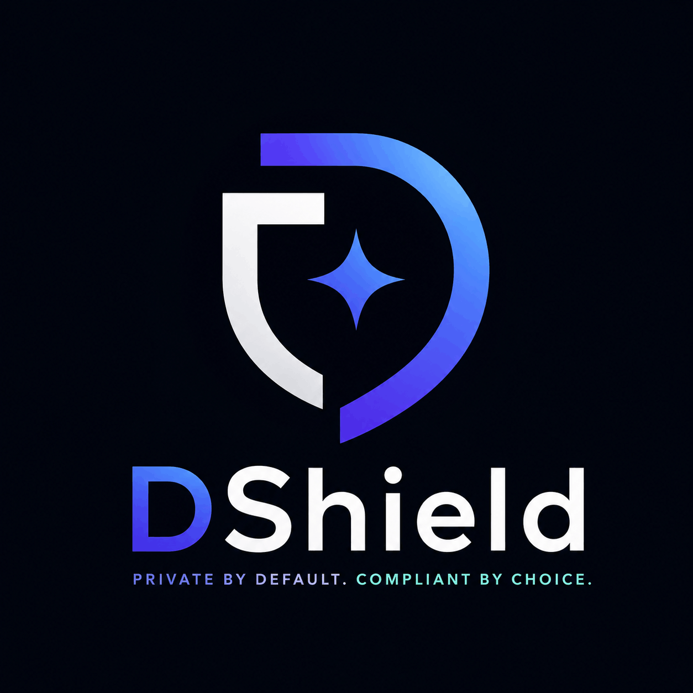

<p align="center">
  
</p>

# DShield

> **Private by Default. Compliant by Choice.**

DShield is a consumer-grade shielded stablecoin wallet built on Stellar that enables private USDC payments using Zero-Knowledge Proofs (ZKPs).

Users can send and receive funds without publicly exposing transaction amounts, balances, or payment history while retaining the ability to selectively disclose information when required for compliance, auditing, or regulatory reporting.

Built for **Stellar Hacks: Real-World ZK**, DShield demonstrates how privacy and compliance can coexist in modern financial systems.

---

## Vision

Today's digital payments force users to choose between:

* Complete transparency (traditional blockchains)
* Complete anonymity (privacy-focused networks)

Neither option works for real-world finance.

DShield introduces a third model:

> Prove what's true. Reveal nothing else.

Using Zero-Knowledge Proofs, users can prove ownership, authorization, compliance, and transaction validity without exposing sensitive financial information.

---

## Problem

Public blockchains expose:

* Wallet balances
* Transaction history
* Payment amounts
* Financial relationships

Anyone can analyze a user's entire financial activity.

For stablecoins intended for everyday payments, payroll, remittances, and commerce, this level of transparency creates serious privacy concerns.

At the same time, regulators and institutions require mechanisms for compliance and accountability.

Current privacy solutions often sacrifice one for the other.

---

## Solution

DShield combines:

* Shielded transactions
* Zero-Knowledge Proofs
* Selective disclosure
* Compliance-aware architecture

to create a private payments experience that feels like traditional banking while maintaining blockchain security and verifiability.

Users can:

✅ Send private USDC payments

✅ Hide transaction amounts

✅ Hide wallet balances

✅ Prevent transaction graph analysis

✅ Prove compliance without exposing personal data

✅ Reveal information only when necessary

---

## How It Works

### 1. Deposit

Users deposit USDC into a shielded pool.

The deposit creates a cryptographic commitment that represents ownership of funds without revealing balances publicly.

---

### 2. Private Transfer

When sending funds:

* A Zero-Knowledge Proof is generated client-side
* The proof demonstrates:

  * Ownership of funds
  * Valid transaction construction
  * No double-spending
  * Balance preservation

without revealing:

* Sender
* Receiver
* Amount

---

### 3. On-Chain Verification

A Soroban smart contract verifies the proof using Stellar's native ZK primitives.

Only the proof validity is revealed.

No private transaction data becomes public.

---

### 4. Selective Disclosure

Users can generate specialized proofs for:

#### Compliance Proof

Prove:

* KYC completed
* Wallet authorized
* Jurisdiction approved

without revealing identity information.

#### Audit Proof

Prove:

* Source of funds
* Transaction legitimacy
* Ownership of assets

without exposing unrelated transactions.

#### Regulatory Reporting

Reveal only the specific information required by regulators while preserving overall financial privacy.

---

## Implementation Status

What is **built and verified on-chain today** (testnet), versus the broader vision above:

| Capability | Status |
| --- | --- |
| Shielded deposit (USDC → commitment in a Merkle tree) | ✅ Working on testnet |
| Client-side ZK proof (Noir + UltraHonk, keccak transform) | ✅ |
| On-chain proof verification (Soroban + BN254/Poseidon2) | ✅ |
| Shielded withdrawal to any recipient | ✅ |
| Double-spend prevention (nullifiers) | ✅ |
| Recipient binding (anti front-running) | ✅ |
| **Relayer** — withdrawer's account never appears on-chain | ✅ |
| Compliance: KYC registry + compliance proof verification | ✅ Verified on testnet via CLI (`just demo-compliance`); not yet wired into the web app UI. `disclosed_amount` is cross-checked against the real pool's fixed `deposit_amount` on-chain, not self-asserted by the prover |
| Selective disclosure: threshold proofs (balance ≥ X) | ✅ Circuit + contract implemented and CLI-verified; no web UI yet. `threshold` is likewise checked against the pool's real `deposit_amount` on-chain |
| Arbitrary-amount private *transfers* between users | 🚧 Future (today: fixed-denomination pools) |

DShield is currently a **fixed-denomination shielded pool** (Tornado-style: deposit a tier amount, withdraw it to any address). Privacy comes from breaking the on-chain link between depositor and recipient — not from hiding the tier amount. Relayed withdrawals mean the withdrawer never signs or pays a fee from their own account.

---

## Live on Testnet

Deployed to Stellar **testnet** (`Test SDF Network ; September 2015`). View on [Stellar Expert](https://stellar.expert/explorer/testnet):

| Contract | ID |
| --- | --- |
| Shielded pool (10 USDC tier) | `CBQ3EPNIMGLS53U4HHLT4V3HAGJJCLONVXAN2QEREGQZMFQOLK7VF6C7` |
| UltraHonk verifier | `CA64EBZWHEXVBJRQ3U76MRDVZUMIOL6TYTGG6427URU3OV5D3ZLXNKCM` |
| Compliance | `CDU7ARSZFXBGXHLUFO6AF3MDPVJNWBBOEGDI57FP3E2OR4I4M6DCVPDR` |
| Test USDC (SAC) | `CDYZE3XQZA2UYUTYEEVLOKSYDD44CQZ6LYJIKQEDIUYBXNVSNXEQVGEG` |

A full **deposit → relayed withdraw** loop has been executed on testnet: the pool paid the recipient, the nullifier was consumed, and re-submitting the same proof failed with `NullifierUsed`.

---

## Build, Run & Verify

**Prerequisites:** Rust + `wasm32v1-none`, [`stellar` CLI](https://developers.stellar.org/docs/tools/cli), [Noir (`nargo`)](https://noir-lang.org/docs) + Barretenberg (`bb`), Node + `pnpm`, [`just`](https://github.com/casey/just). Run `just setup` to check.

```bash
# Run all tests (Rust contracts + frontend) — 85 contract + 50 frontend tests
just test

# Local: start a quickstart network, fund accounts, deploy everything,
# and write frontend/.env.local
just start && just deploy

# Testnet: deploy all contracts and point the app at testnet
just deploy testnet

# Run the wallet UI
cd frontend && pnpm install && pnpm dev   # http://localhost:3000
```

`just deploy` provisions the verifier, three pool tiers (10/100/1000 USDC), a test-USDC asset, a compliance contract, plus a **faucet issuer** and a **relayer** account, and writes the matching `frontend/.env.local`.

---

## One-Command Demo

```bash
just demo             # privacy loop: deposit -> ZK proof -> relayed withdraw
just demo-compliance  # compliant disclosure: register KYC -> ZK proof -> verify
```

`just demo` runs the whole privacy loop on-chain and prints each step: it deposits into the pool, generates a real ZK proof bound to the recipient, submits the withdrawal **through the relayer** (so your account never appears on-chain), and verifies the recipient was paid and the nullifier consumed.

`just demo-compliance` runs the compliant-disclosure loop: an admin registers a KYC hash, a real compliance proof (KYC ownership + note ownership + selective amount disclosure, bound to an auditor key) is generated, and the contract verifies it on-chain — plus a negative check proving an unregistered KYC hash is rejected. Both demos take the network as an argument (e.g. `just demo-compliance testnet`).

---

## Security Model

Three properties hold the system together (each enforced on-chain and covered by tests):

1. **Hash consistency** — the contract's Poseidon2 (`soroban_poseidon`) produces byte-identical output to the Noir circuit and the frontend, so the on-chain Merkle root always matches the root the proof is generated against. Locked by `test_recipient_hash_matches_frontend`, `test_single_leaf_root_matches_circuit`.
2. **Recipient binding** — the withdrawal proof commits to a recipient hash, and the contract recomputes that hash from the actual payout address (`recipient_hash_from_address`) and rejects a mismatch. Without this, anyone could front-run a pending withdrawal and redirect the funds. This is also what makes the relayer trustless: it can submit or refuse, but never steal.
3. **Double-spend prevention** — each withdrawal consumes a nullifier stored in persistent storage; replaying a proof fails with `NullifierUsed`.

Unbounded data (commitments, nullifiers) lives in **persistent storage** with TTL extension, so the size-capped instance entry doesn't grow with usage.

> ⚠️ Testnet demo only — unaudited. `frontend/.env.local` holds throwaway dev/faucet/relayer secrets and is gitignored; do not reuse them or carry this to mainnet without an audit. The relayer takes no fee (eats gas) and is a single point of censorship (not theft).

---

## Why Stellar

Stellar has recently introduced native support for modern ZK verification through Protocol 25 and Protocol 26.

These upgrades provide:

* BN254 elliptic curve operations
* Pairing checks
* Poseidon hashing
* Multi-scalar multiplication
* Efficient zkSNARK verification

This allows DShield to verify proofs on-chain efficiently and affordably.

---

## Architecture

```text
+-----------------------+
|      DShield App      |
+-----------------------+
            |
            v
+-----------------------+
| Client-side Prover    |
| (Noir / zkSNARKs)     |
+-----------------------+
            |
            v
+-----------------------+
| Shielded Pool         |
| Commitments           |
| Nullifiers            |
+-----------------------+
            |
            v
+-----------------------+
| Soroban Verifier      |
| BN254 Verification    |
+-----------------------+
            |
            v
+-----------------------+
| Stellar Network       |
+-----------------------+
```

## Tech Stack

### Blockchain

* Stellar
* Soroban

### Zero-Knowledge

* Noir
* UltraHonk
* zkSNARKs
* BN254

### Cryptography

* Poseidon Hash
* Poseidon2 Hash
* Merkle Trees

### Frontend

* Next.js
* TypeScript
* TailwindCSS

### Wallet Integration

* Freighter Wallet

### Storage

* Encrypted local notes
* Optional decentralized backup

---

## Core Features

### Private Payments

Send stablecoins privately.

### Shielded Balances

Wallet balances remain hidden.

### Client-Side Proof Generation

Sensitive data never leaves the user's device.

### Compliance Proofs

Generate proofs without revealing personal information.

### Selective Disclosure

Reveal only what is necessary.

### Consumer-Grade UX

Designed for ordinary users, not cryptography experts.

---

## Future Roadmap

### Phase 1

* Shielded deposits
* Shielded transfers
* Proof verification

### Phase 2

* Compliance credentials
* Selective disclosure
* Auditor access proofs

### Phase 3

* Private payroll
* Private merchant payments
* Confidential business treasury management

### Phase 4

* Cross-border remittances
* Confidential RWA settlements
* Institutional privacy infrastructure

---

## Example Use Cases

### Payroll

Employees receive salaries without exposing compensation publicly.

### Business Payments

Companies protect supplier relationships and payment amounts.

### Remittances

Families receive funds privately.

### Personal Finance

Users maintain financial confidentiality while using stablecoins.

### Institutional Settlement

Organizations can transact confidentially while remaining compliant.

---

## Competitive Advantage

| Feature              | Traditional Blockchain | Privacy Coins | DShield |
| -------------------- | ---------------------- | ------------- | ------- |
| Private Payments     | ❌                      | ✅             | ✅       |
| Compliance Friendly  | ✅                      | ❌             | ✅       |
| Selective Disclosure | ❌                      | ❌             | ✅       |
| Stablecoin Focus     | ✅                      | ❌             | ✅       |
| Consumer UX          | ⚠️                     | ⚠️            | ✅       |

---

## Hackathon Track

**Stellar Hacks: Real-World ZK**

DShield showcases how Zero-Knowledge technology can unlock practical privacy for stablecoin payments without sacrificing compliance, usability, or trust.

---

## Team

Built with the belief that privacy should be a default right, not a premium feature.

---

## License

MIT License
